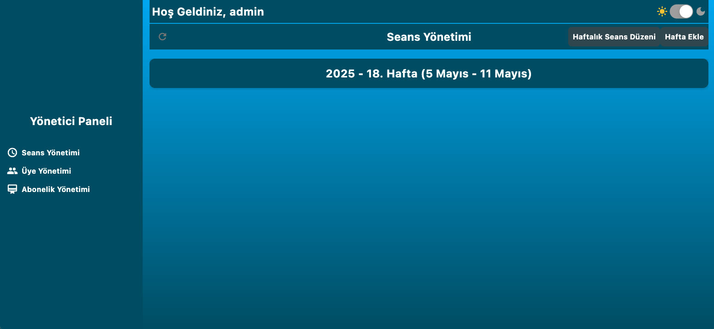
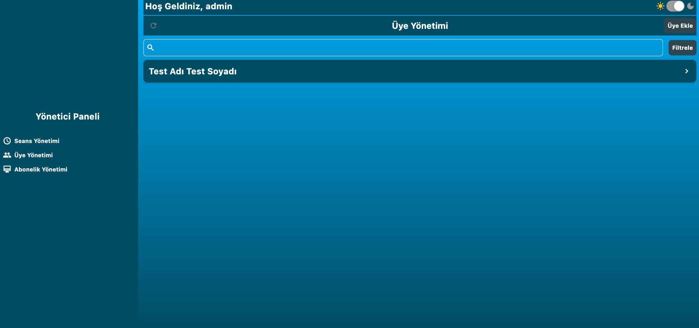
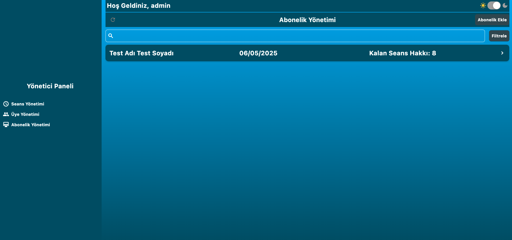
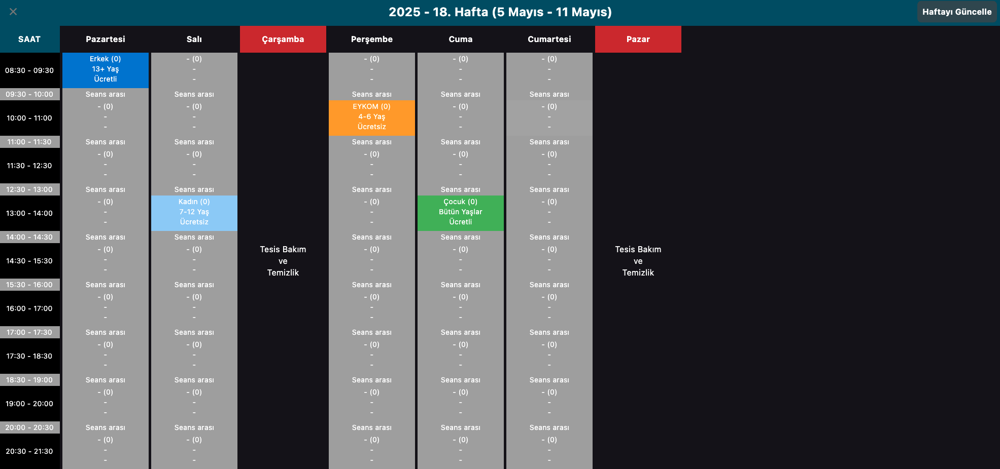
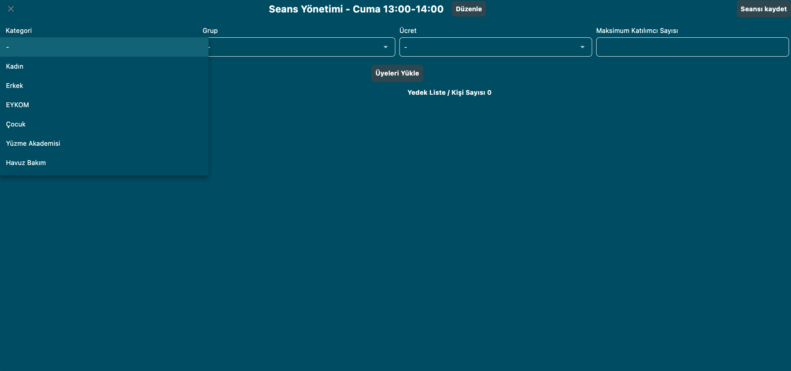
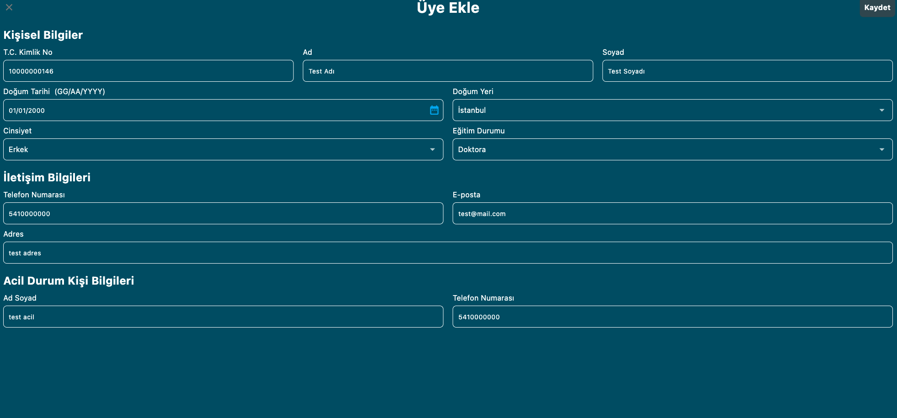
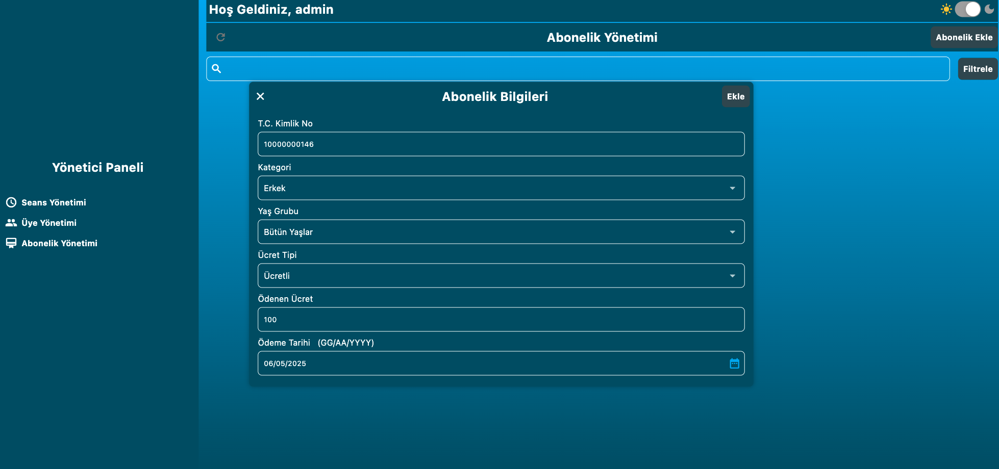

# 🏋️ Spor Merkezi Full Stack Uygulaması

Bu proje, bir spor merkezi yönetim sistemi için tamamen **full stack** olarak geliştirilmiş bir uygulamadır. Hem **Node.js + Express + MongoDB** tabanlı backend API’si\*\* hem de **Flutter** ile geliştirilen çapraz platform **frontend** arayüzü içerir. Uygulama; web, Windows, macOS ve mobil (iOS/Android) platformlarında yatay ekran desteğiyle çalışacak şekilde optimize edilmiştir.

---

## 🚀 Temel Özellikler

### Backend (API)

* 👥 **Üye & Seans Yönetimi:** Üye kayıt, güncelleme, silme ve seans atama.
* 📅 **Haftalık Aktivite Takibi:** Haftalık spor programları oluşturma ve görüntüleme.
* 📄 **Dosya Yükleme:** PDF ve görsel dosya yükleme (Multer + GridFS).
* 🔐 **JWT ile Kimlik Doğrulama:** Güvenli login ve yetkilendirme.
* 🔍 **Dinamik Arama & Filtreleme:** Üye, seans ve aktivitelere dair güçlü sorgular.
* 🛠️ **TypeScript:** Tip güvenliği ve temiz kod.

### Frontend (Flutter)

* 📱 **Çapraz Platform UI:** iOS, Android, Windows ve macOS desteği.
* 🎨 **Modern Tasarım:** Responsive ve yatay ekranlarda akıcı kullanıcı deneyimi.
* 🔄 **Gerçek Zamanlı Veri Güncelleme:** API ile tam entegre, oturum açma, seans yönetimi ve bildirimler.
* 📊 **Dashboard & Grafikler:** Üye istatistikleri ve kullanım raporları.
* 🗂️ **PDF Görüntüleme:** Yüklenen dokümanları uygulama içinde önizleme.

---

## 🛠️ Teknoloji Yığını

| Katman       | Teknoloji                                                           |
| ------------ | ------------------------------------------------------------------- |
| **Backend**  | Node.js, Express, TypeScript, MongoDB, Mongoose, JWT, Multer/GridFS |
| **Frontend** | Flutter, Dart, Provider/MVVM                                        |
| **Araçlar**  | Git, VS Code, Android Studio, Xcode                                 |

---

## 🏗️ Mimari & Dosya Yapısı

```
repo-root/
├─ backend/
│  ├─ src/
│  │  ├─ controllers/
│  │  ├─ models/
│  │  ├─ routes/
│  │  └─ services/
│  ├─ dist/
│  ├─ .env
│  ├─ tsconfig.json
│  └─ package.json
└─ frontend/
   ├─ lib/
   │  ├─ models/
   │  ├─ viewmodels/
   │  ├─ views/
   │  └─ main.dart
   ├─ assets/
   ├─ android/
   ├─ ios/
   └─ pubspec.yaml
```

---

## 🚧 Kurulum & Çalıştırma

### Ortam Gereksinimleri

* [Node.js](https://nodejs.org/) (v18+)
* [MongoDB](https://www.mongodb.com/try/download/community)
* [Flutter SDK](https://flutter.dev/docs/get-started/install)

---

## 📈 Ekran Görüntüleri

**Ana Ekran Haftalar**  


**Ana Ekran Üyeler**  


**Ana Ekran Abonelikler**  


**Haftalık Seans Düzeni**  


**Seans Ekle/Güncelle**  


**Üye Ekleme**  


**Abonelik Ekleme**  

